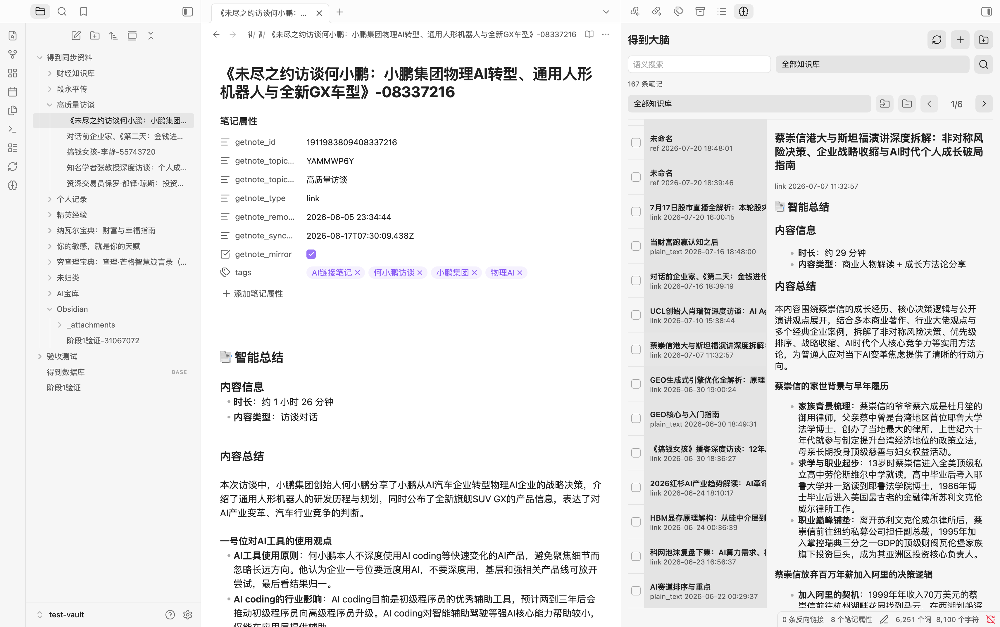
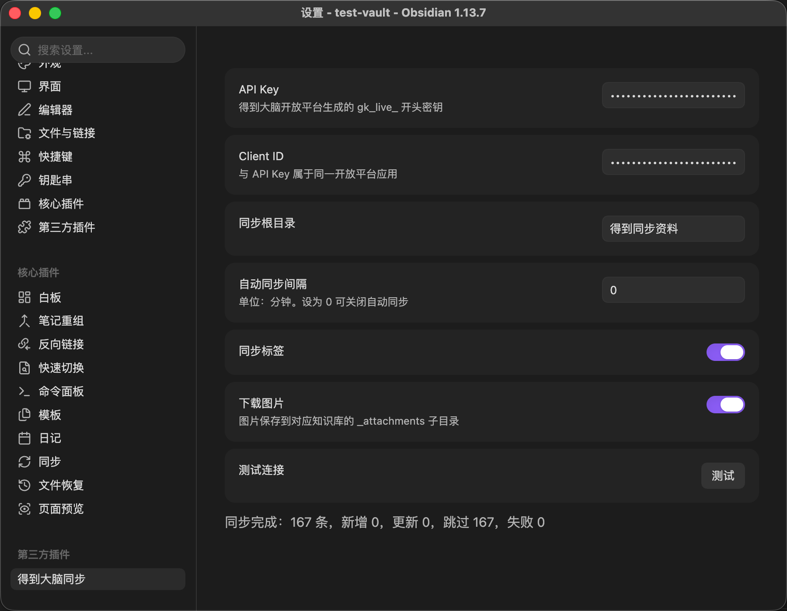
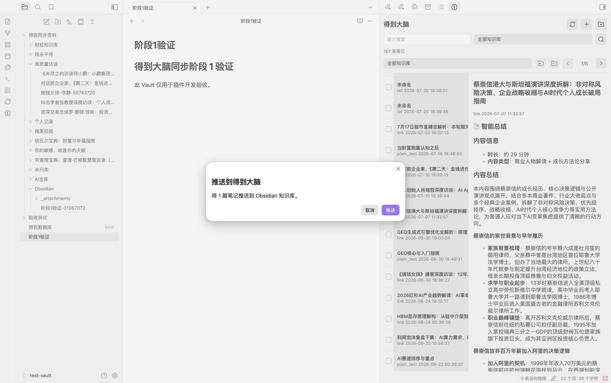

# Getnote Sync

Getnote Sync provides controlled, two-way synchronization between Getnote knowledge bases and a local vault.

<p align="center">
  
</p>

## Features

- Mirror Getnote notes to Markdown files, organized by knowledge base.
- Push the current note, a single selected file, or multiple selected files to Getnote.
- Browse, filter, search, create, tag, and categorize notes in the built-in dashboard.
- Download images and attachments, retain conflict copies, clean orphaned attachments, and export sync failures.

## How Synchronization Works

Getnote is the remote knowledge source, while the vault is a local mirror and editing surface.

- **Pull synchronization** fetches remote note lists and details on startup, on a schedule, or when manually requested. Markdown frontmatter records the remote note ID, knowledge-base ID, content hash, and last synchronization time.
- **Push synchronization** is explicitly initiated from the command palette, file context menu, multi-file context menu, or dashboard. The plugin creates or updates the corresponding remote note in the Getnote `Obsidian` knowledge base.
- **Change detection** compares remote hashes, local mirror hashes, and file state. Unchanged notes are skipped to prevent duplicate writes.
- **Safety boundaries** keep automatic synchronization read-only. Creating, updating, tagging, categorizing, and recovery actions require an explicit user action.
- **Conflicts and attachments** are handled without silently overwriting local edits. Attachments are stored in a dedicated `_attachments` directory and can be cleaned when no longer referenced.

## Installation

### Community plugins

After approval in the community directory, search for `Getnote Sync` in the plugin browser.

### Manual installation

Copy these files to `.obsidian/plugins/getnote-sync/` inside your vault:

```text
main.js
manifest.json
styles.css
```

Then enable `Getnote Sync` in the community plugin settings.

## Configuration

Configure the following values in the plugin settings:

- API key beginning with `gk_live_`
- Client ID
- Synchronization root folder
- Automatic synchronization interval
- Synchronization tags
- Image downloads

Use **Test connection** to validate the current credentials and configuration.

## Screenshots

<p align="center">
  
</p>

<p align="center">
  
</p>

<p align="center">
  
</p>

## Build

```bash
npm install
npm run typecheck
npm test
npm run build
```

## Security

- Automatic synchronization only reads remote content.
- Remote writes require an explicit user action.
- Credentials are stored in the plugin's `data.json` file.
- Write requests are not retried automatically to avoid duplicate note creation.

## Development Notes

See [Stage 0 findings](docs/stage-0-findings.md) and the [end-to-end acceptance record](docs/e2e-acceptance-20260817.md) for implementation and validation details.
